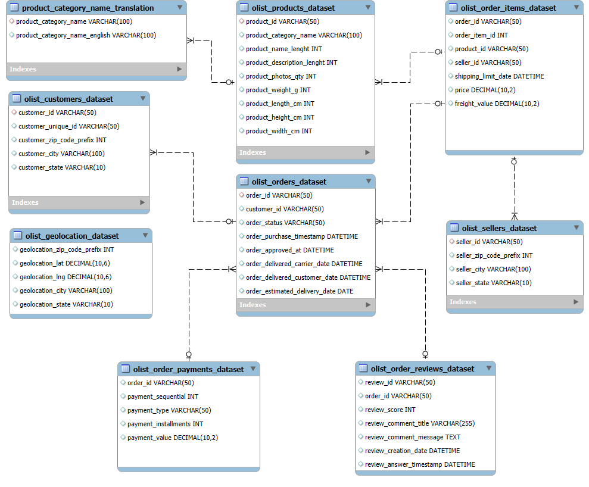
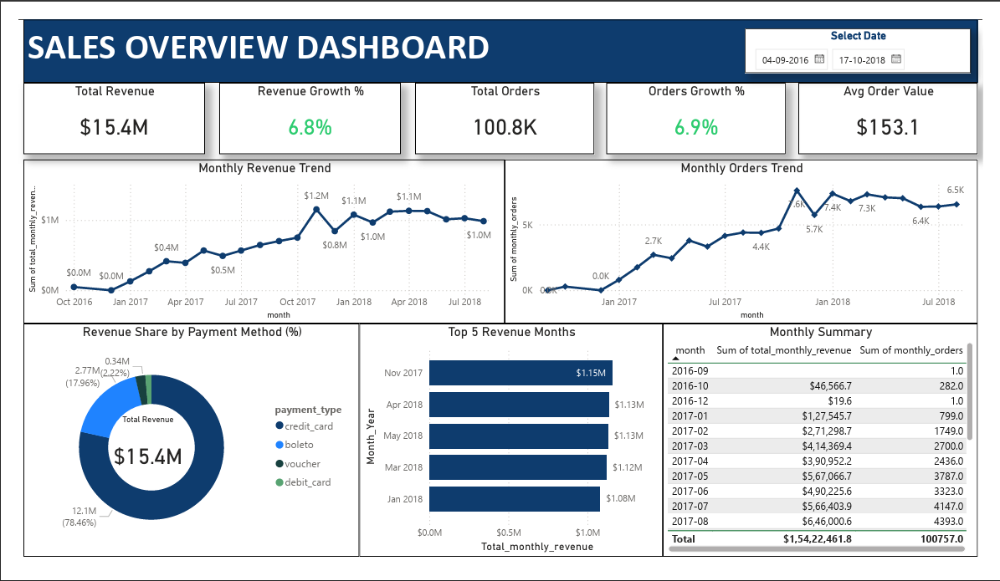
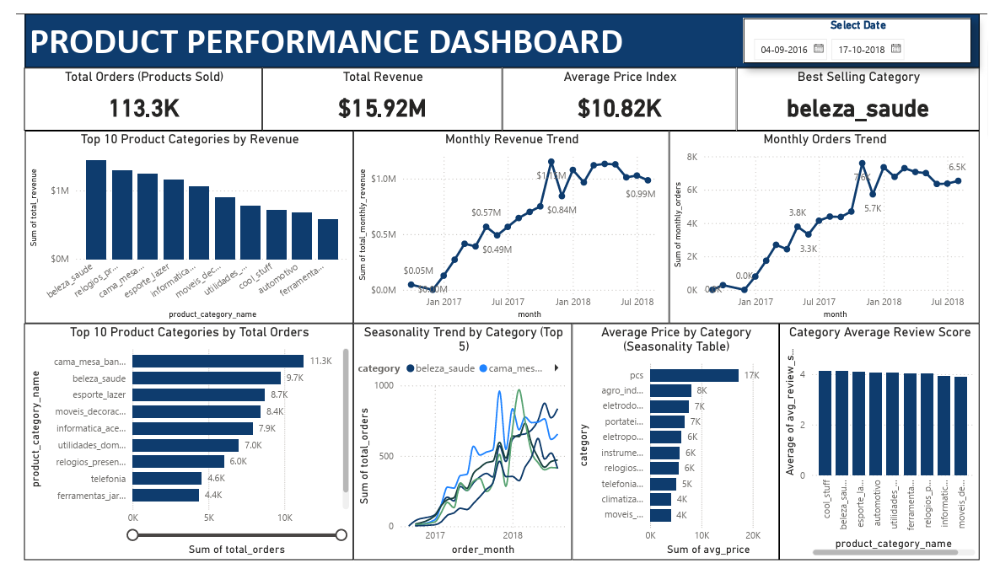
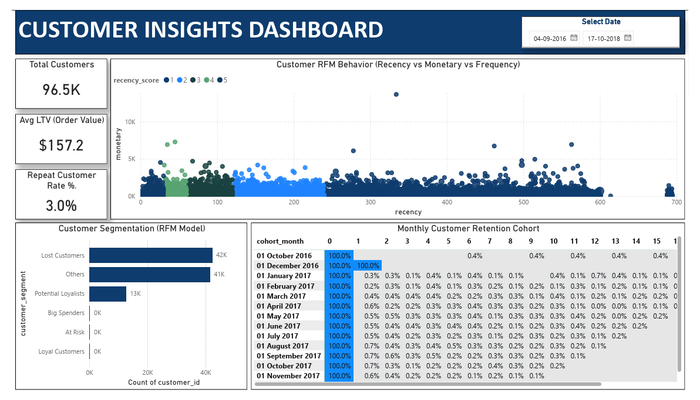
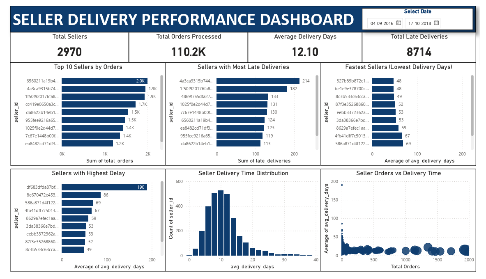
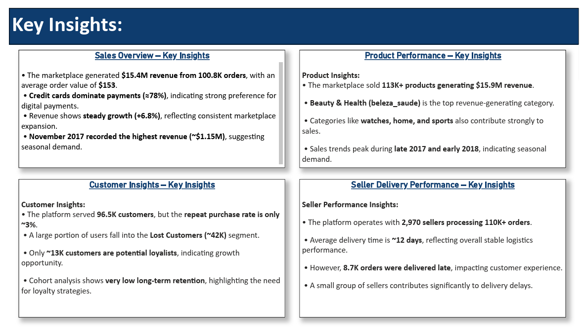

```markdown


# 📊 Olist E-Commerce Data Analysis – End-to-End SQL Project

A comprehensive SQL-based analysis of the Brazilian **Olist e-commerce marketplace**, exploring customer behavior, product performance, logistics efficiency, payment trends, and seller performance using real-world marketplace data.

---

# 📌 Project Overview

This project presents an **end-to-end data analysis of the Brazilian Olist E-commerce marketplace** using SQL, Python, and Power BI.

The objective is to analyze customer behavior, sales performance, product trends, payment patterns, delivery efficiency, and seller performance to generate actionable business insights.

The analysis covers **100K+ orders, 96K+ customers, and 2,900+ sellers** across Brazil.

This project demonstrates a **complete analytics workflow**:

```

Raw Dataset → Data Cleaning → SQL Analysis → Business Insights → Power BI Dashboards

```

---

# 📊 Key Marketplace Metrics

• **Total Revenue:** $15.4M  
• **Total Orders:** 100.8K  
• **Total Customers:** 96.5K  
• **Total Sellers:** 2,970  
• **Average Order Value:** $153  
• **Late Deliveries:** 8,700+

---

# 🧠 Business Problem

The Olist marketplace operates with thousands of sellers and customers across Brazil.

However, marketplace growth depends on understanding:

• Customer purchasing behavior  
• Product category performance  
• Payment preferences  
• Seller logistics performance  
• Customer retention trends  

Without clear analytics, it becomes difficult to identify:

• Revenue growth drivers  
• High-performing product categories  
• Delivery bottlenecks  
• Customer churn patterns  
• Regional demand differences  

This project analyzes the Olist marketplace dataset to provide **data-driven insights** that support operational improvements and strategic decision-making.

---

# 📈 Business Impact

The insights from this analysis can help the marketplace:

• Improve logistics performance and reduce late deliveries  
• Identify top-performing product categories for expansion  
• Increase customer retention through targeted marketing  
• Optimize payment strategies based on customer preferences  
• Support seller performance monitoring  

These insights provide actionable intelligence that can help **increase revenue, improve customer satisfaction, and strengthen marketplace efficiency**.

---

# 🎯 Business Objectives

The analysis aims to answer key marketplace questions:

• How is revenue growing over time?  
• Which product categories generate the highest revenue?  
• What payment methods dominate transactions?  
• How strong is customer retention?  
• Which sellers contribute to delivery delays?  
• What geographic regions generate the most customers?

---

# 🗂 Dataset Description

Dataset Source:  
https://www.kaggle.com/datasets/olistbr/brazilian-ecommerce

The project uses the **Brazilian E-commerce Public Dataset by Olist (Kaggle)** containing multiple relational tables.

Main tables used:

```

customers
orders
order_items
order_payments
order_reviews
products
sellers
geolocation
product_category_name_translation

```

Dataset size:

• **100K+ orders**  
• **96K+ customers**  
• **2,900+ sellers**  
• **113K+ products sold**

---

# 🛠 Tools & Technologies

| Purpose | Tool |
|------|------|
Database | MySQL |
SQL Development | MySQL Workbench |
Data Cleaning | Excel |
Data Processing | Python (Pandas) |
Visualization | Power BI |
Version Control | GitHub |

---

# 🗄 Database Schema

The database schema illustrates relationships between customers, orders, products, payments, and sellers.



Key relationships:

```

customers → orders
orders → order_items
orders → order_payments
orders → order_reviews
products → order_items
sellers → order_items
product_category_name_translation → products

```

---

# 📌 Repository Guide

• **Datasets** – Raw and cleaned Olist data  
• **SQL** – Analysis queries and insight scripts  
• **Query Results** – Exported analysis outputs  
• **Documentation** – Project reports and summaries  
• **Power BI Dashboard** – Interactive visualizations  
• **References** – ER diagram and dataset documentation

---

# 📂 Project Structure

```

Olist_SQL_Project
│
├── README.md
│
├── 01_Datasets
│   ├── Raw_Dataset
│   └── Cleaned_Dataset
│
├── 02_SQL
│   ├── Queries
│   └── Insights
│
├── 03_Documentation
│   ├── Project_Overview.md
│   ├── Insights_Summary.md
│   └── Final_Report_Olist_SQL_Project.md
│
├── 04_Query_Results
│   ├── CSV_Files
│   ├── Excel_Files
│   └── Images
│
├── 05_References
│   ├── ER_Diagram.png
│   └── Data_Dictionary.md
│
└── 06_PowerBI_Dashboard
├── PBIX_Files
├── Images
└── Exports

```

---

# 📊 Power BI Dashboards

## Sales Overview Dashboard


Key metrics:

• **Total Revenue:** $15.4M  
• **Total Orders:** 100.8K  
• **Average Order Value:** $153  
• **Revenue Growth:** 6.8%

---

## Product Performance Dashboard



Insights:

• **113K+ products sold**  
• **$15.9M total product revenue**  
• **Beauty & Health category dominates revenue**  
• Clear seasonal trends in product demand

---

## Customer Insights Dashboard


Highlights:

• **96.5K customers analyzed**  
• **Repeat purchase rate ~3%**  
• Majority customers belong to **Lost Customer segment**  
• Cohort analysis shows **very low long-term retention**

---

## Seller Delivery Performance Dashboard



Key findings:

• **2,970 active sellers**  
• **Average delivery time ~12 days**  
• **8,700+ late deliveries recorded**  
• Small group of sellers contributes to most delivery delays

---

# 📈 Key Business Insights



### Marketplace Performance

• Marketplace generated **$15.4M revenue from 100K+ orders**  
• **Credit cards dominate payments (~78%)**  
• Revenue shows **steady growth trend**

### Product Insights

• **Beauty & Health** is the top revenue-generating category  
• Strong performance from **home, watches, and sports**

### Customer Insights

• **96.5K customers served**  
• **Repeat purchase rate only ~3%**  
• Majority users are **one-time buyers**

### Seller Performance

• Platform operates with **2,970 sellers**  
• **Average delivery time ~12 days**  
• **8.7K late deliveries** affect customer satisfaction

---

# 📊 Analysis Modules

The project contains **20 SQL analysis modules**, including:

```

Customer Distribution Analysis
Seller Distribution Analysis
Payment Behavior Analysis
Product Category Performance
Customer RFM Segmentation
Delivery Performance Analysis
Customer Lifetime Value
Revenue Trend Analysis
Cohort Retention Analysis
Category Seasonality Analysis
Marketplace Geography Analysis

```

Each module contains:

• SQL queries  
• Exported results  
• Insight summaries  
• Business interpretation

---

# 💡 Skills Demonstrated

✔ SQL Data Analysis  
✔ Data Cleaning & Preparation  
✔ Relational Data Modeling  
✔ Exploratory Data Analysis  
✔ Customer Segmentation (RFM)  
✔ Cohort Retention Analysis  
✔ Business Insight Generation  
✔ Power BI Dashboard Development  
✔ End-to-End Analytics Workflow  

---

# 👤 Author

**Shivalingappa Yalagi**

Aspiring Data Analyst specializing in:

• SQL  
• Power BI  
• Python (Pandas)  
• Data Analytics

---

# ⭐ Future Improvements

Potential extensions for this project:

• Customer churn prediction model  
• Delivery delay prediction using machine learning  
• Geographic sales forecasting  
• Customer lifetime value modeling

---

