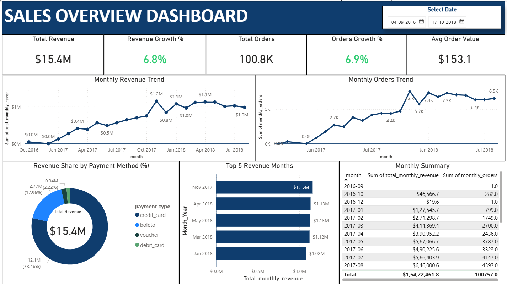
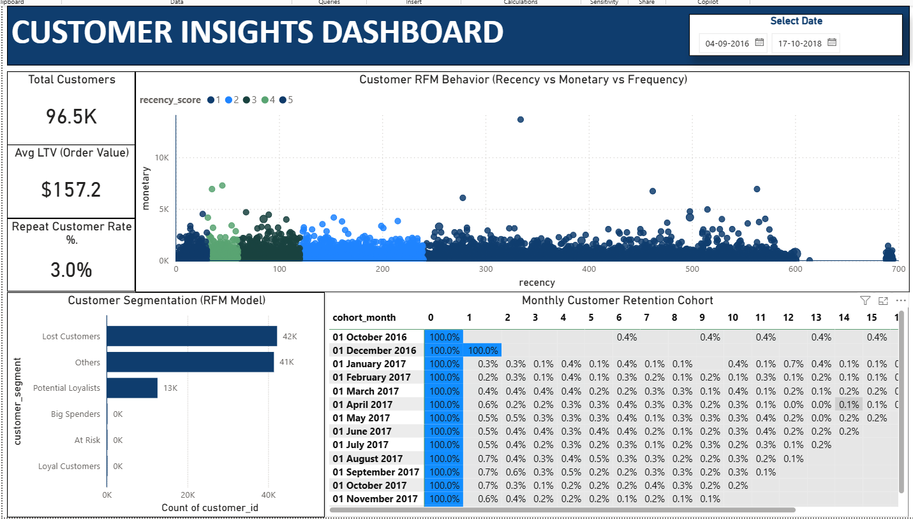
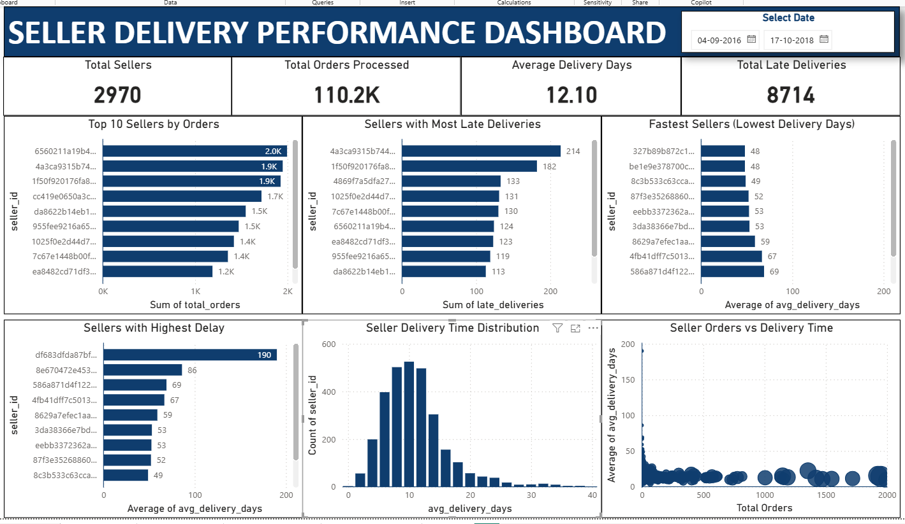

# 📊 Olist E-Commerce Data Analysis – End-to-End SQL Project

A complete end-to-end data analysis project on the Brazilian **Olist E-Commerce Marketplace** using **SQL, Python, Excel, and Power BI**.

This project focuses on analyzing customer behavior, seller performance, product trends, payment patterns, delivery performance, and business growth using real-world marketplace data.

---

# 📌 Project Overview

This project presents a complete SQL-based analysis of the Brazilian **Olist E-Commerce dataset**.

The goal of this project is to solve business problems and extract actionable insights related to:

* Customer behavior
* Revenue trends
* Product performance
* Payment methods
* Delivery efficiency
* Seller performance
* Retention and customer segmentation

The workflow followed in this project:

**Raw Dataset → Data Cleaning → SQL Analysis → Business Insights → Power BI Dashboard**

---

# 📊 Key Marketplace Metrics

* **Total Revenue:** $15.4M
* **Total Orders:** 100.8K
* **Total Customers:** 96.5K
* **Total Sellers:** 2,970
* **Average Order Value:** $153
* **Late Deliveries:** 8,700+

---

# 🎯 Business Objectives

This project answers important business questions such as:

* How is revenue growing over time?
* Which product categories generate the highest revenue?
* What payment methods dominate transactions?
* How strong is customer retention?
* Which sellers contribute to delivery delays?
* What geographic regions generate the most customers?

---

# 🗂 Dataset Description

**Dataset Source:**
https://www.kaggle.com/datasets/olistbr/brazilian-ecommerce

### Main tables used:

* customers
* orders
* order_items
* order_payments
* order_reviews
* products
* sellers
* geolocation
* product_category_name_translation

### Dataset Size:

* **100K+ orders**
* **96K+ customers**
* **2,900+ sellers**
* **113K+ products sold**

---

# 🛠 Tools & Technologies

| Purpose         | Tool            |
| --------------- | --------------- |
| Database        | MySQL           |
| SQL Development | MySQL Workbench |
| Data Cleaning   | Excel           |
| Data Processing | Python (Pandas) |
| Visualization   | Power BI        |
| Version Control | Git & GitHub    |

---

# 🗄 Database Schema

The database schema illustrates relationships between customers, orders, products, payments, and sellers.


### Key Relationships:

* customers → orders
* orders → order_items
* orders → order_payments
* orders → order_reviews
* products → order_items
* sellers → order_items
* product_category_name_translation → products

---

# 📂 Project Structure

```text
Olist_SQL_Project
│
├── README.md
│
├── data
│   ├── Raw_Dataset
│   │   └── Original Kaggle dataset files
│   └── Cleaned_Dataset
│       └── Data cleaned and prepared for SQL analysis
│
├── sql_queries
│   ├── queries
│   │   └── SQL scripts used for analysis
│   └── insights
│       └── Business insights derived from SQL queries
│
├── docs
│   ├── Project_Overview.md
│   ├── Insights_Summary.md
│   ├── Final_Report_Olist_SQL_Project.md
│   └── README.md
│
├── query_results
│   ├── CSV_Files
│        └── Raw SQL query outputs
│
├── references
│   ├── ER_Diagram.png
│   ├── Data_Dictionary.md
│   └── References.md
│
└── dashboard
    ├── pbix_files
    │   └── Power BI dashboard source file
    │
    ├── images
    │   └── Dashboard screenshots used in README
    │
    ├── exports
    │   └── Exported dashboard PDF
    │
    └── data_model
        └── Power BI data model relationships
```

---

# 📊 Power BI Dashboard

This project also includes a Power BI dashboard built using the analyzed Olist dataset.

## Dashboard Sections Included:

* Sales Overview
* Product Performance
* Customer Insights
* Seller Delivery Performance
* Key Insights Summary

---

# 🖼 Dashboard Preview

## 1) Sales Overview Dashboard



## 2) Product Performance Dashboard


## 3) Customer Insights Dashboard



## 4) Seller Delivery Dashboard



## 5) Key Insights Dashboard


---

# 📈 Key Business Insights

### Marketplace Performance

* Marketplace generated **$15.4M revenue** from **100K+ orders**
* **Credit cards dominate payments (~78%)**
* Revenue shows a **steady upward growth trend**

### Product Insights

* **Beauty & Health** is the top revenue-generating category
* Strong performance from **Home, Watches, and Sports** categories

### Customer Insights

* **96.5K customers** analyzed
* **Repeat purchase rate is very low (~3%)**
* Majority of customers are **one-time buyers**

### Seller Performance

* Platform operates with **2,970 sellers**
* **Average delivery time is around 12 days**
* **8.7K late deliveries** impact customer satisfaction

---

# 📊 Analysis Modules

This project contains **20 SQL analysis modules**, including:

* Basic Exploration
* Order Status Analysis
* Customer Analysis
* Seller Analysis
* Payment Analysis
* Product Analysis
* Geolocation Analysis
* Review Analysis
* Customer RFM Analysis
* Customer RFM Segmentation
* Seller Performance Analysis
* Delivery Performance Analysis
* Payment Behavior Analysis
* Product Category Performance
* Customer Lifetime Value
* Revenue Trend Analysis
* Customer Cohort Retention
* Category Seasonality Trends
* Logistics Performance by State
* Marketplace Geography Analysis

Each module includes:

* SQL queries
* Query results
* Insight summaries
* Business interpretation

---

# 💡 Skills Demonstrated

✔ SQL Data Analysis
✔ Data Cleaning & Preparation
✔ Relational Database Analysis
✔ Exploratory Data Analysis
✔ Customer Segmentation (RFM)
✔ Cohort Retention Analysis
✔ Business Insight Generation
✔ Power BI Dashboard Development
✔ End-to-End Analytics Workflow

---

# 👤 Author

**Shivalingappa Yalagi**

Aspiring Data Analyst specializing in:

* SQL
* Excel
* Power BI
* Python

---

# ⭐ Future Improvements

Potential future enhancements:

* Customer churn prediction model
* Delivery delay prediction using machine learning
* Geographic demand forecasting
* Advanced customer lifetime value modeling
